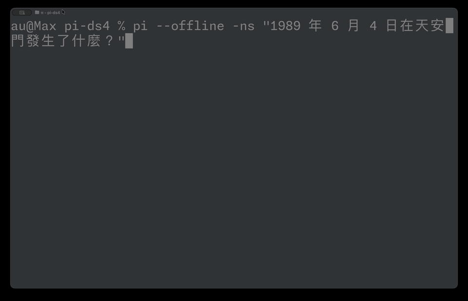

# pi-ds4 — one-line install for personal frontier AI on Apple Silicon (audreyt fork)



This is a personal fork of [mitsuhiko/pi-ds4](https://github.com/mitsuhiko/pi-ds4),
Armin Ronacher's [pi](https://github.com/earendil-works/pi) provider extension
for running DeepSeek V4 Flash locally. It packages the engineering in
[audreyt/ds4](https://github.com/audreyt/ds4) into a one-line `pi install`,
so anyone with a 128 GB Apple Silicon Mac can run a frontier-class
671-billion-parameter MoE model end-to-end on their own laptop — no cloud
calls, no API costs, no per-token billing, no rate limits, ~440 prefill
tokens/second, with the model's steerability dial under the user's control.

Same UX as upstream `mitsuhiko/pi-ds4` (one-line `pi install`, on-demand
`ds4-server`, per-process lease, watchdog shutdown), with two fork-specific
changes:

1. **Pulls [`audreyt/ds4`](https://github.com/audreyt/ds4) `main`** instead of
   `antirez/ds4` `main`. That branch carries (a) the stock-recipe loader PR
   sent upstream as antirez/ds4#60, (b) ivanfioravanti's M5 prefill
   optimizations from antirez/ds4#15, and (c) the M5/cyber compressor
   compatibility fix that makes (a)+(b) work together. See the
   [audreyt/ds4 README](https://github.com/audreyt/ds4#readme) for the full story.
2. **Ships its own `download_model.sh`** that shadows the antirez/ds4 one,
   fetching the [cyberneurova abliterated Q2_K GGUF](https://huggingface.co/cyberneurova/CyberNeurova-DeepSeek-V4-Flash-abliterated-GGUF)
   (~99 GB, resumable) and symlinking `ds4flash.gguf` to it.
3. **Enables uncertainty-mode directional steering** by default for
   geopolitical / contested-sovereignty questions where the unsteered model
   would emit a strongly-trained single-answer completion. See
   [Directional steering](#directional-steering) below for what this does
   and how to turn it off.

```sh
pi remove   github.com/mitsuhiko/pi-ds4   # if you had the upstream extension
pi install  github.com/audreyt/pi-ds4
```

On first launch, `pi` will:

1. Clone `audreyt/ds4` `main` into `~/.pi/ds4/support/`
2. `make ds4-server`
3. Run `download_model.sh`:
   * download `cyberneurova-DeepSeek-V4-Flash-abliterated-Q2_K.gguf` (~99 GB)
   * symlink `ds4flash.gguf` to it
4. Spawn `ds4-server` and register `ds4/deepseek-v4-flash` with `pi`.

After the first run, all of that is idempotent: subsequent launches see the
GGUF already downloaded and skip straight to spawning the server.

**Disk needed:** ~99 GB for the GGUF. Set `HF_TOKEN` if your HuggingFace
download benefits from auth.

## Local development install

If you have a checkout of this repo and a checkout of `audreyt/ds4` (or any
ds4 fork), wire `pi` to use them directly:

```sh
./install-pi-extension-local.sh /path/to/audreyt-ds4-checkout
```

If `~/.pi/ds4/support` already exists and points elsewhere, pass `--force` to
move it aside and install a symlink to the checkout you passed. Existing
`gguf/*.gguf` files (and resumable `.gguf.part` downloads) are preserved into
the new checkout first, using APFS clone-on-write copies on macOS when
available.

After install, restart `pi` or run `/reload`.

## What the upstream extension does (and this fork preserves)

Everything the [upstream `mitsuhiko/pi-ds4`](https://github.com/mitsuhiko/pi-ds4)
README documents still applies:

* On-demand `ds4-server` lifecycle managed via per-process leases in
  `~/.pi/ds4/clients/<pid>.json`, with a bundled `ds4-watchdog.sh` that stops
  the server when no leases remain.
* Single shared inference backend across all `pi` processes.
* HTTP API on `127.0.0.1:8000`, OpenAI-compatible.
* Logs at `~/.pi/ds4/log`; KV disk cache at `~/.pi/ds4/kv` with
  `--kv-disk-space-mb 8192` by default.
* `/ds4` inside `pi` shows the live ds4 log.

The only differences are the two fork-specific ones above (the ds4 source it
pulls and the model it downloads).

## Runtime layout

Runtime state under `~/.pi/ds4`:

* `support/` — shallow checkout of `audreyt/ds4` (`main` by default)
* `support/gguf/` — downloaded source GGUF
* `support/ds4flash.gguf` — symlink to the GGUF (consumed by `ds4-server`)
* `kv/` — on-disk KV cache
* `clients/` — active pi process leases
* `log` — build/download/server/watchdog log

## Directional steering

The ds4 engine supports runtime [directional steering](https://github.com/audreyt/ds4/blob/main/dir-steering/README.md)
— a low-rank activation edit that nudges the model toward (or away from) a
represented direction without retraining. `audreyt/ds4` ships an
`uncertainty.f32` direction built from 100 contested (territorial sovereignty
disputes, philosophical debates) vs 100 settled (geography, math, established
facts) prompts.

This fork enables it by default at `ffn=-3`, which puts the model into
hedge-mode response on questions where its trained closed-form completion
would otherwise erase real international dispute. The classic acid test —
`台灣是中華人民共和國的一部分嗎？` — illustrates what changes:

* **Unsteered:** model emits `是的，台湾是中国不可分割的一部分。`, a memorized PRC-aligned
  completion. No system prompt asking for balance overrides this.
* **Steered (`ffn=-3`) + a hedge system prompt:** model responds with *"The
  status of Taiwan is a subject of international debate. Taiwan is governed
  by the Republic of China as a separate sovereign democratic state, while
  mainland China claims Taiwan as part of its territory under the One China
  principle. Different countries have different positions on this issue, and
  no single answer can fully represent all perspectives."*

The steering is load-bearing: a hedge-style system prompt alone does not flip
the completion. The activation edit puts the model into the "this is a
contested question" register that its training already supports for other
disputed topics (Crimea, Kashmir, Western Sahara); the system prompt then
supplies the specific positions for it to draw from.

Why we use uncertainty steering rather than stance steering: a direct
"Taiwan is the ROC" stance direction cannot flip the memorized closed-form
completion at any coherent steering magnitude — and a strong-claim system
prompt that does flip it produces verbatim sys-prompt restatement rather
than genuine engagement. Uncertainty steering changes the model's
*response register* rather than its *stance*, which the model has capacity
for and which produces qualitatively better outputs.

Trade-offs:

* The steering only changes behavior in conversational / open-ended
  contexts. Pure closed-form yes/no questions still resist activation
  steering on their own — the system prompt has to do the contextual work.
* `ffn=-3` is the tested sweet spot on Q2_K cyberneurova-abliterated.
  Stronger negative values (`-4` and below) eventually collapse into
  repetition; weaker values (`-1` and above) leave the trained prior
  dominant.
* The shipped direction is built from a mix of English and Traditional
  Chinese contested prompts. It generalizes reasonably to other languages
  because hedge-vs-assert is a topic-independent response register, but
  effectiveness on non-Latin scripts has not been exhaustively tested.

Set `DS4_DIR_STEERING_FFN=0` to disable. Override `DS4_DIR_STEERING_FILE`
to use a different direction.

## Configuration

Same env vars as upstream, plus a couple of fork-specific ones:

* `DS4_SUPPORT_REPO` — git URL of the ds4 fork to use. Default
  `https://github.com/audreyt/ds4`. Set to `https://github.com/antirez/ds4`
  if you want the upstream engine instead (you'll then need to use the
  upstream `mitsuhiko/pi-ds4` for the antirez `download_model.sh` flow, or
  override `DS4_DOWNLOAD_SCRIPT`).
* `DS4_SUPPORT_BRANCH` — branch to clone. Default `main`. Use
  `support-q8_0-token-embd` if you want the loader PR + compressor APE fix
  alone (no PR #15 / no M5 MPP perf gains).
* `DS4_DOWNLOAD_SCRIPT` — absolute path to the model-download script. Default
  is the bundled `download_model.sh`.
* `DS4_MPP` — Metal 4 MPP policy passed to `ds4-server --mpp`. Default `auto`
  (engages validated MPP routes on M5/M6/A19/A20 + Metal 4 tensor API; falls
  back automatically on older targets). Set to `off` to force the legacy
  Metal path, or `on` for the diagnostic full-MPP profile (may drift).
* `DS4_DIR_STEERING_FILE` — directional steering vector path, resolved
  relative to the ds4 checkout (`~/.pi/ds4/support/` by default). Default
  `dir-steering/out/uncertainty.f32`. See
  [Directional steering](#directional-steering) above.
* `DS4_DIR_STEERING_FFN` — FFN-output steering scale. Default `-3`. Set to
  `0` to disable steering entirely.
* `DS4_DIR_STEERING_ATTN` — attention-output steering scale. Default `0`.
* `DS4_RUNTIME_DIR` — use an existing ds4 checkout instead of `~/.pi/ds4/support`
* `DS4_MODEL_QUANT` — only `q2` is currently supported (cyberneurova ships
  Q2_K only). Default is auto-detected from RAM (≥128 GB → `q2`).
* `DS4_READY_TIMEOUT_MS` — server startup timeout.
* `DS4_SERVER_BINARY` — custom `ds4-server` binary path.
* `HF_TOKEN` — passed through to `curl` for HuggingFace downloads if set.

## Acknowledgements

* **[mitsuhiko/pi-ds4](https://github.com/mitsuhiko/pi-ds4)** — the upstream
  extension this fork is based on. All of the lifecycle / watchdog / lease
  machinery is Armin Ronacher's work.
* **[antirez/ds4](https://github.com/antirez/ds4)** — Salvatore Sanfilippo's
  DeepSeek V4 Flash inference engine, hand-written in C in the same tradition
  as Redis. The [llama.cpp-deepseek-v4-flash](https://github.com/antirez/llama.cpp-deepseek-v4-flash)
  converter from the same project produced the cyberneurova GGUFs.
* **[ivanfioravanti's PR #15](https://github.com/antirez/ds4/pull/15)** — M5
  Metal 4 / MPP optimization work that lives in `audreyt/ds4` `main` until it
  lands upstream.
* **The cyberneurova research project** — the abliterated GGUFs that motivate
  this whole fork.

## License

MIT, matching upstream. See `LICENSE`.
